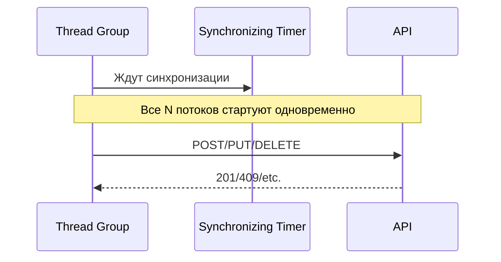

# Детальные сценарии JMeter для проверки конкурентного доступа

## Общие настройки для всех сценариев
- **Базовый URL**: `http://localhost:15123`
- **Авторизация**: Все запросы используют Bearer token после логина. Использовать CSV Data Set с users.csv (test123/test123 и т.д.).
- **Synchronizing Timer**: Для одновременного запуска запросов (groupSize = N потоков).
- **Assertions**: Response Assertion на коды (201/409/422/404/204), JSON Path на сообщения ошибок (e.g. содержит \"duplicate\").
- **Listeners**: View Results Tree, Summary Report.
- **Thread Group**: Ramp-up 0 для concurrency.
- **Переменные**: User Defined Variables для общих ID/значений (e.g. ${sharedHeadId}, ${sharedPassportId}).

## 1. Конкурентное создание объектов

### Цель
Проверить, что при одновременном создании с одинаковыми уникальными полями только один успешен (201), остальные - 409/422 с сообщением о дубликате.

### Подсценарии
- **Dragons с одинаковым headId**:
  - Thread Group: 10 threads, ramp-up 0, loop 1.
  - Предварительно: Создать один DragonHead (POST /api/dragon-heads), извлечь ID в ${sharedHeadId}.
  - Синхронизация: Synchronizing Timer (groupSize=10) перед POST /api/dragons.
  - Body: `{"name": "Dragon_${__threadNum}", "headId": ${sharedHeadId}, ...}` (остальное уникально).
- **Persons с одинаковым passportId**:
  - Аналогично, ${sharedPassportId} = "PASSPORT_123".
  - POST /api/people.
- **Locations с одинаковыми (x,y,z,name)**:
  - ${sharedX}=100, ${sharedY}=200, ${sharedZ}=300.5, ${sharedName}="TestLoc".
  - POST /api/locations.

### Ожидаемые результаты
- 1x 201 Created.
- 9x 409 Conflict или 422 Unprocessable Entity с JSON: `{\"message\": "duplicate..."}`.
- Assertion: Response Code в [201,409,422]; JSON содержит "duplicate" или "headId"/"passportId".

## 2. Конкурентное обновление одного объекта

### Цель
Проверить обработку race condition (оптимистическая блокировка?).

### Настройка
- Предварительно: Создать один объект (Dragon/Person/Location), ID в ${sharedObjId}.
- Thread Group: 10 threads.
- Синхронизация перед PATCH /api/{entity}/${sharedObjId}.
- Body: `{"name": "Updated_${__threadNum}"}`.

### Ожидаемые результаты
- 1x 200 OK.
- Остальные: 409 Conflict (если версия) или 200 (последовательное обновление).
- Проверить финальное состояние: Только последние изменения (GET после).

## 3. Конкурентное удаление одного объекта

### Цель
Первый DELETE успешен (204), остальные 404.

### Настройка
- Создать объект, ${sharedObjId}.
- Thread Group: 10 threads.
- Synchronizing Timer перед DELETE /api/{entity}/${sharedObjId}.

### Ожидаемые результаты
- 1x 204 No Content.
- 9x 404 Not Found.
- Assertion: Response Code в [204,404].

## 4. Конфликт обновления и удаления

### Цель
Обеспечить консистентность (обновление после удаления -> 404).

### Настройка
- Thread Group: 2 threads.
- Thread 1: DELETE /api/{entity}/${objId}.
- Thread 2: PATCH /api/{entity}/${objId} (синхронизация).
- Дополнительно: GET для проверки отсутствия.

### Ожидаемые результаты
- DELETE: 204.
- PATCH: 404.
- Или наоборот, в зависимости от порядка (но не оба успешны).

## 5. Пакетный импорт в условиях конкуренции

### Цель
Несколько импортов с конфликтующими данными.

### Настройка
- Создать test_conflict.json с дублирующимися уникальными полями (e.g. одинаковый passportId).
- Thread Group: 10 threads.
- CSV: filename=data/test_conflict.json.
- Synchronizing Timer перед POST /api/batch-import (multipart file=${filename}).

### Ожидаемые результаты
- Каждый импорт: 200 OK, но в response (BatchImportResponseDto) ошибки для дубликатов.
- Assertion: JSON содержит "successCount", "errorCount" >0.

## Рекомендации по реализации
- Создать отдельный Thread Group для каждого сценария в jmeter/Lab2 Test.jmx.
- Использовать Inter-Thread Communication (Shared Queue) для передачи ID между threads.
- Тестировать на запущенном сервере (docker-compose up).
- Очистка: DELETE после тестов или truncate tables.

**Следующие шаги**: Добавить в JMeter план, протестировать.